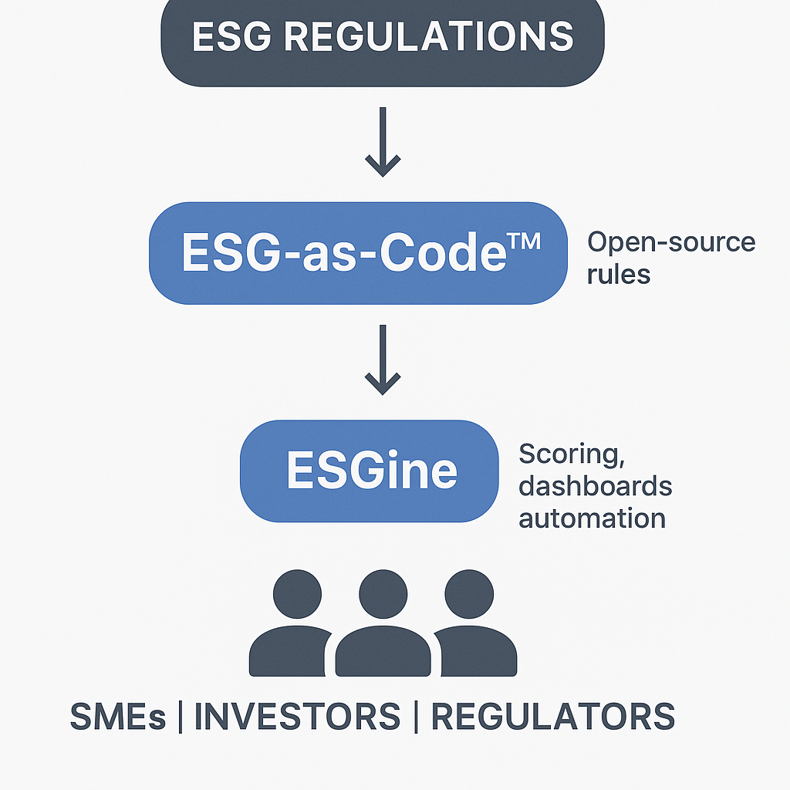

# ESG-as-Code™ 🧩

**ESG-as-Code™** is a legal-tech framework that transforms global ESG regulations into structured, machine-readable, and programmable logic.

I’m Isaiah Owolabi — a RegTech innovator focused on bridging the gap between policy and automation in environmental, social, and governance (ESG) compliance.

---

## 🔧 What I’m Building

### ⚙️ ESG-as-Code™  
An open-source rule engine for automating ESG compliance  
Built for developers, auditors, and regulators to:
- Encode ESG rules from ISSB, FCA, SFDR, SEC, and more
- Run auditable ESG checks
- Power ESG-aware apps and platforms

➡️ GitHub Repo: [ESG-as-Code™](https://github.com/ESGasCode/esgascode)

---

### 📊 ESGine *(Powered by ESG-as-Code™)*  
A RegTech SaaS platform for real-time ESG scoring, dashboards, and rule-based automation.

**ESGine** is the user-friendly interface layered on top of ESG-as-Code™ — designed for:
- SMEs & Enterprises managing ESG disclosures
- Investors & rating agencies needing fast ESG validation
- Legal teams ensuring regulatory alignment

---

## 🌍 Regulatory Scope

- 🇬🇧 **UK** – FCA ESG Ratings Regime  
- 🇪🇺 **EU** – SFDR, EU Taxonomy  
- 🇺🇸 **US** – SEC Climate Disclosure  
- 🌐 **Global** – ISSB (IFRS S1 & S2)

---

## 🧠 ESG-as-Code™ Ecosystem

Here’s how the components of the ESG-as-Code™ initiative work together:



---

## 📁 Rule Packs (`/rules` Directory)

This folder contains machine-readable ESG compliance rules...

### ✅ Example Rule Format

```yaml
id: SEC_ESG_001
authority: SEC
jurisdiction: US
required_fields:
  - scope_1_2_emissions
compliance_check:
  - field: "scope_1_2_emissions"
    must_exist: true
```  <-- THIS IS THE CLOSING BACKTICK

---

## 💡 **Vision**

To become the logic layer of ESG regulation globally — ensuring transparency, automation, and trust in how ESG is measured and reported.

---

## 📬 **Get in Touch**

📧 Email: io@esgascode.com  
🌐 Website: [https://esgascode.com](https://esgascode.com) *(coming soon)*  
GitHub: [@ESGasCode](https://github.com/ESGasCode)

